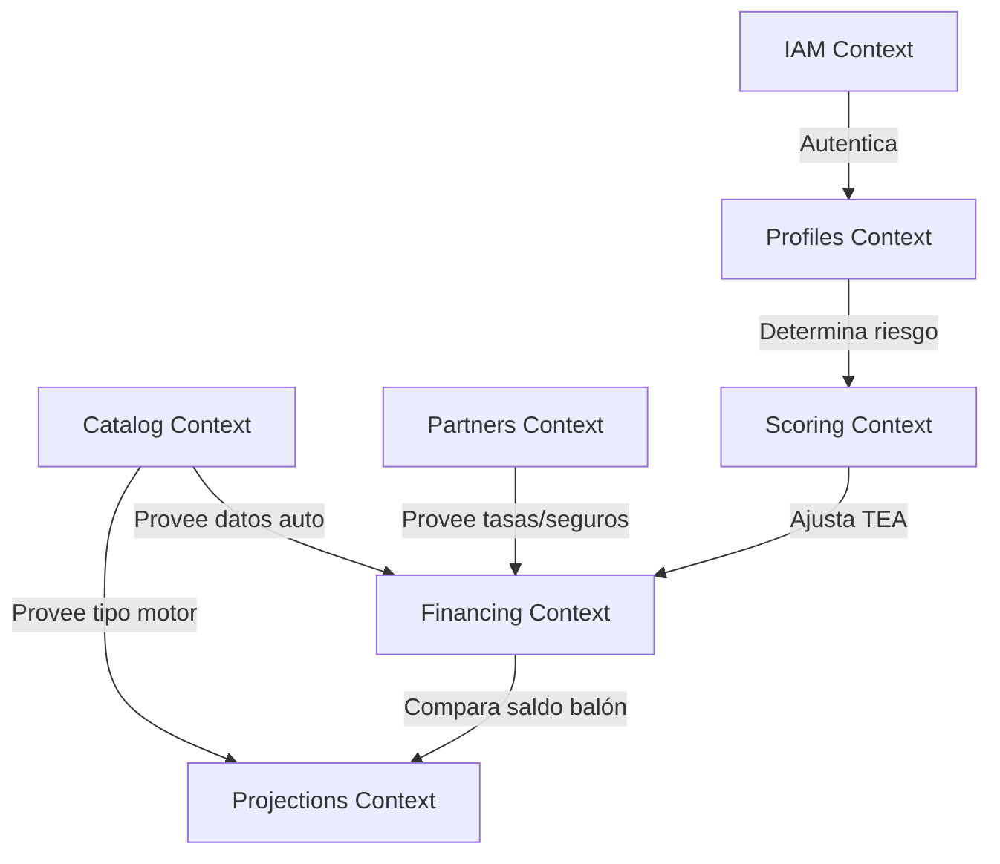

# Arquitectura del Backend — Diseño de Bounded Contexts (DDD)

Este documento detalla el diseño de la arquitectura orientada a **Domain-Driven Design (DDD)** para el backend de la plataforma **SmartFinance Drive Platform**. La estructura se basa en las referencias de modelado limpio y modular de `driveos-platform`, adaptada a las necesidades de negocio del simulador financiero SBS.

---

## 1. Mapa de Bounded Contexts (Contextos Acotados)

La aplicación monolítica se subdivide en siete Bounded Contexts bien delimitados. Cada uno de ellos encapsula sus propias reglas de negocio, modelos de dominio y detalles de persistencia.



---

## 2. Detalle de los Bounded Contexts

### A. **`iam` (Identity & Access Management)**
*   **Responsabilidad:** Autenticación de usuarios, registro, manejo de sesiones y emisión de tokens de seguridad (JWT). 
*   **Agregado Principal (Aggregate Root):** `User` (el cual extiende `AbstractDomainAggregateRoot`).
*   **Value Objects:** `UserId`, `EmailAddress`, `Password`.
*   **Contratos de Repositorio:** `UserRepository`.
*   **Propósito de Negocio:** Dar soporte a los endpoints de inicio de sesión (`login`), registro (`signup`) y cierre de sesión (`logout`).

### B. **`profiles` (Customer Profiles)**
*   **Responsabilidad:** Gestión de la información personal, laboral y socioeconómica del cliente de manera desacoplada de las credenciales de la cuenta.
*   **Agregado Principal (Aggregate Root):** `Profile` (enlazado a un `UserId` del contexto IAM).
*   **Value Objects:** `ProfileId`, `DocumentNumber` (DNI/CE), `PhoneNumber`, `Income` (ingreso neto).
*   **Contratos de Repositorio:** `ProfileRepository`.
*   **Propósito de Negocio:** Almacenar de forma segura el perfil del cliente para determinar su capacidad crediticia y actualizar sus configuraciones socioeconómicas.

### C. **`catalog` (Vehicle Catalog)**
*   **Responsabilidad:** Gestión de los vehículos disponibles para financiamiento. Incluye características como precio, año, categoría de depreciación e información sobre motorización (para calificar a bonos ecológicos).
*   **Agregado Principal (Aggregate Root):** `Vehicle`.
*   **Value Objects:** `VehicleId`, `Price` (dinero y tipo de moneda), `MotorizationType` (Ecológico/Combustión).
*   **Contratos de Repositorio:** `VehicleRepository`.
*   **Propósito de Negocio:** Servir de catálogo confiable. La simulación financiera leerá el precio y características directamente del servidor para evitar alteraciones fraudulentas en el cliente.

### D. **`partners` (Financial Partners)**
*   **Responsabilidad:** Administración de las entidades bancarias asociadas (BCP, BBVA, Interbank), sus rangos de tasas (TEA mín/máx), comisiones, tasas fijas de desgravamen y seguros vehiculares.
*   **Agregado Principal (Aggregate Root):** `FinancialEntity`.
*   **Entidades internas:** `RateBenchmark` (indicadores y benchmarks vigentes).
*   **Contratos de Repositorio:** `FinancialEntityRepository`, `RateBenchmarkRepository`.
*   **Propósito de Negocio:** Soportar la lógica de cotizaciones multi-banco y el benchmarking dinámico de tasas de mercado.

### E. **`financing` (Core Simulation - Dominio Principal)**
*   **Responsabilidad:** El corazón financiero de la aplicación. Orquesta la creación del plan de financiamiento, genera el cronograma de cuotas (aplicando el método francés con días exactos, gracia total/parcial, cuotas dobles en julio/diciembre y seguros endosados/financiados) y calcula los indicadores de TIR, TCEA y VAN.
*   **Agregado Principal (Aggregate Root):** `Simulation` (que contiene a las entidades de `PaymentPeriod` en su frontera del agregado).
*   **Servicio de Dominio (Domain Service):** `FinancingPlanBuilder` (donde reside el algoritmo puro de cálculo de cuotas).
*   **Value Objects:** `SimulationId`, `PeriodNumber`, `Interest`, `Amortization`, `TCEA`, `VAN`.
*   **Contratos de Repositorio:** `SimulationRepository`, `PaymentScheduleRepository`.
*   **Propósito de Negocio:** Generar, guardar y eliminar simulaciones y cronogramas detallados de pago.

### F. **`scoring` (Credit Scoring & Risk Assessment)**
*   **Responsabilidad:** Evaluar la capacidad de pago del cliente. Calcula el Ratio de Cobertura de Deuda (DTI) cruzando la cuota mensual proyectada con los ingresos del perfil del cliente, y le asigna un nivel de riesgo (Tier A, B, C) que ajustará automáticamente la tasa de interés.
*   **Agregado Principal (Aggregate Root):** `RiskAssessment` o `Score`.
*   **Propósito de Negocio:** Automatizar la aprobación o el ajuste de tasas de interés personalizadas basadas en el riesgo del usuario (Crédito Realista).

### G. **`projections` (Depreciation & Valuation Projections)**
*   **Responsabilidad:** Estimar la depreciación futura del vehículo a 2, 3 o 5 años y contrastarla contra la cuota balón del modelo "Compra Inteligente" para alertar al usuario y sugerirle la mejor decisión financiera.
*   **Agregado Principal (Aggregate Root):** `DepreciationProjection`.
*   **Propósito de Negocio:** Ofrecer asesoramiento de "decisiones inteligentes" al vencimiento del contrato.

---

## 3. Estructura del Código Fuente (Arquitectura Limpia)

Siguiendo el diseño del proyecto de referencia, nuestro código base en el backend se estructurará bajo esta jerarquía de paquetes dentro de `src/main/java/com/smartfinance/smartfinancedriveplatform`:

```text
com.smartfinance.smartfinancedriveplatform
│
├── shared (Código común que cruza contextos, ej. Base Aggregate Root)
│   ├── domain.model.aggregates.AbstractDomainAggregateRoot
│   └── ...
│
├── iam (IAM Context)
│   ├── domain (model.aggregates [User], model.valueobjects, repositories)
│   ├── application (use cases, services, DTOs)
│   ├── infrastructure (JPA entities, persistence adapters, security)
│   └── interfaces (REST controllers)
│
├── profiles (Customer Profiles Context)
│   └── domain | application | infrastructure | interfaces
│
├── catalog (Vehicle Catalog Context)
│   └── domain | application | infrastructure | interfaces
│
├── partners (Financial Partners Context)
│   └── domain | application | infrastructure | interfaces
│
├── financing (Core Simulation Context)
│   └── domain | application | infrastructure | interfaces
│
├── scoring (Credit Scoring Context)
│   └── domain | application | infrastructure | interfaces
│
└── projections (Depreciation Projections Context)
    └── domain | application | infrastructure | interfaces
```

Cada carpeta interna representa una capa de la arquitectura hexagonal/cebolla:
*   **`domain`**: Contiene la lógica empresarial pura (Agregados, Entidades de dominio, Value Objects y Contratos de repositorio). **No depende de JPA ni de frameworks**.
*   **`application`**: Contiene los casos de uso, servicios de aplicación y DTOs de transferencia de datos.
*   **`infrastructure`**: Implementación de adaptadores de persistencia JPA (`entities`, `repositories` de Spring Data, `assemblers` para mapeo a dominio), configuración del framework, clientes HTTP y seguridad.
*   **`interfaces`**: Controladores REST (`@RestController`) y modelos de Request/Response HTTP.
