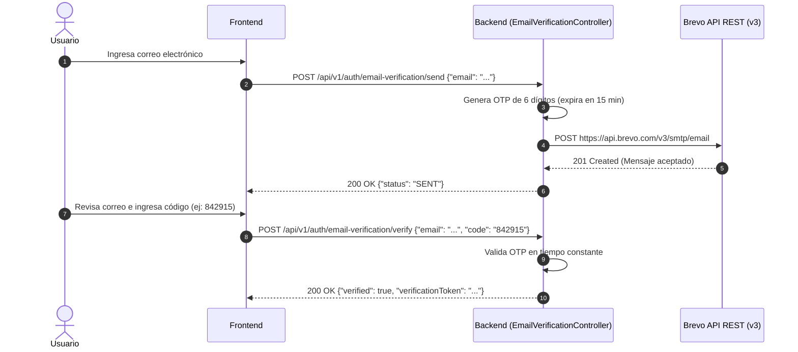
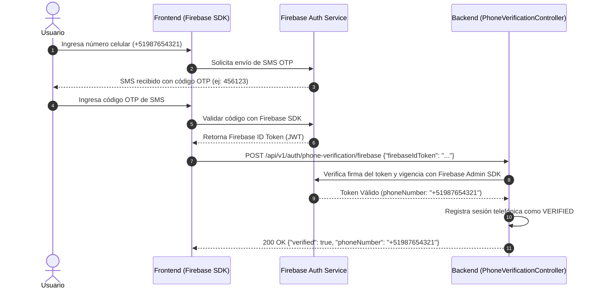

# Flujo de Autenticación y Autorización por Rol - SmartFinance Drive Platform

Este documento describe de manera detallada la arquitectura de autenticación (JWT & OAuth2), los procesos de verificación de identidad previa/complementaria (OTP Email vía Brevo y SMS vía Firebase), y los flujos específicos de registro, inicio de sesión y gestión de roles para cada tipo de usuario en la plataforma.

---

## 1. Arquitectura General de Autenticación

La seguridad de **SmartFinance Drive Platform** se basa en **JSON Web Tokens (JWT)** sin estado (Stateless), autenticación federada (Google OAuth2), y verificación de identidad multi-factor (Email OTP vía Brevo API REST y SMS OTP vía Firebase Authentication).

### Cabecera de Autorización
Todas las peticiones a endpoints protegidos deben incluir el token Bearer en el header HTTP:
```http
Authorization: Bearer <JWT_ACCESS_TOKEN>
```

Todos los endpoints bajo la ruta `/api/v1/auth/**` son **100% públicos** (`permitAll()`), lo que permite realizar el registro, la verificación de correo, la confirmación telefónica y el inicio de sesión sin necesidad de token previo.

---

## 2. Flujos Comunes de Autenticación y Verificación Pública

### 2.1. Registro Estándar
Crea una cuenta básica en la plataforma con el rol por defecto `ROLE_USER`.
* **Endpoint:** `POST /api/v1/auth/registrations`
* **Payload:**
  ```json
  {
    "email": "usuario@ejemplo.com",
    "password": "Password123!",
    "firstName": "Juan",
    "lastName": "Pérez"
  }
  ```
* **Respuesta (HTTP 201 Created):**
  ```json
  {
    "id": 1,
    "email": "usuario@ejemplo.com",
    "firstName": "Juan",
    "lastName": "Pérez",
    "roles": ["ROLE_USER"]
  }
  ```

---

### 2.2. Inicio de Sesión (Login)
Autentica al usuario y retorna su token de acceso JWT y token de refresco.
* **Endpoint:** `POST /api/v1/auth/sessions`
* **Payload:**
  ```json
  {
    "email": "usuario@ejemplo.com",
    "password": "Password123!"
  }
  ```
* **Respuesta (HTTP 200 OK):**
  ```json
  {
    "token": "eyJhbGciOi...",
    "refreshToken": "4a7b9c1d-8eef-4123-90ab-cdef12345678",
    "user": {
      "id": 1,
      "email": "usuario@ejemplo.com",
      "roles": ["ROLE_USER"]
    }
  }
  ```

---

### 2.3. Autenticación con Google (OAuth2)
Autenticación o registro inmediato utilizando un `idToken` emitido por Google Sign-In en el cliente.
* **Endpoint:** `POST /api/v1/auth/google`
* **Payload:**
  ```json
  {
    "idToken": "eyJhbGciOi..."
  }
  ```

---

### 2.4. Refresco de Token
Emite un nuevo `token` de acceso cuando el actual ha expirado.
* **Endpoint:** `POST /api/v1/auth/tokens`
* **Payload:**
  ```json
  {
    "refreshToken": "4a7b9c1d-8eef-4123-90ab-cdef12345678"
  }
  ```

---

### 2.5. Cierre de Sesión (Logout)
Invalida la sesión activa y revoca el token de refresco.
* **Endpoint:** `DELETE /api/v1/auth/sessions/current`

---

### 2.6. Flujo Detallado: Verificación de Correo por Código OTP (Brevo API)

Este flujo se ejecuta **antes o durante el registro** o para validar la autenticidad del correo del usuario. Utiliza la API v3 de **Brevo (Sendinblue)** mediante HTTPS REST (puerto 443).

#### **Paso 1: Solicitud de Código OTP**
El cliente/frontend solicita el envío de un código de verificación de 6 dígitos.
* **Endpoint:** `POST /api/v1/auth/email-verification/send`
* **Payload:**
  ```json
  {
    "email": "usuario@ejemplo.com"
  }
  ```
* **Respuesta (HTTP 200 OK):**
  ```json
  {
    "email": "usuario@ejemplo.com",
    "status": "SENT",
    "message": "Código OTP enviado exitosamente a usuario@ejemplo.com",
    "expiresInSeconds": 900
  }
  ```

#### **Paso 2: Validación del Código OTP**
El usuario introduce en el frontend el código recibido en su bandeja de entrada.
* **Endpoint:** `POST /api/v1/auth/email-verification/verify`
* **Payload:**
  ```json
  {
    "email": "usuario@ejemplo.com",
    "code": "842915"
  }
  ```
* **Respuesta (HTTP 200 OK):**
  ```json
  {
    "email": "usuario@ejemplo.com",
    "verified": true,
    "verificationToken": "evt_9a8b7c6d5e4f3a2b1c",
    "message": "Correo electrónico verificado correctamente"
  }
  ```



---

### 2.7. Flujo Detallado: Verificación de Teléfono (Firebase Auth SMS)

Este flujo se ejecuta **durante el registro**, **completado de perfil** o al **solicitar evaluación crediticia** para garantizar la validez del número celular mediante la infraestructura de SMS de Firebase.

#### **Paso 1: Validación en el Cliente (Frontend)**
1. El usuario ingresa su número telefónico (ej: `+51987654321`) en la aplicación Web/Móvil.
2. El frontend utiliza la SDK de Firebase (`firebase/auth`) para enviar el mensaje SMS de verificación:
   ```javascript
   const confirmationResult = await signInWithPhoneNumber(auth, phoneNumber, appVerifier);
   ```
3. El usuario ingresa el código SMS recibido en su teléfono.
4. La SDK de Firebase confirma el código y emite un **Firebase ID Token** (JWT firmado por Google/Firebase).

#### **Paso 2: Validación y Confirmación en el Backend**
El frontend envía el `firebaseIdToken` obtenido al servidor para que este verifique criptográficamente su validez contra los servidores de Firebase.
* **Endpoint:** `POST /api/v1/auth/phone-verification/firebase` (o `POST /api/v1/auth/phone-verification`)
* **Payload:**
  ```json
  {
    "firebaseIdToken": "eyJhbGciOiJSUzI1NiIsImtpZCI6..."
  }
  ```
* **Respuesta (HTTP 200 OK):**
  ```json
  {
    "verified": true,
    "phoneNumber": "+51987654321",
    "status": "VERIFIED",
    "verifiedAt": "2026-10-08T18:30:00Z",
    "verificationToken": "pvt_3f2e1d0c9b8a7",
    "message": "Número telefónico verificado exitosamente vía Firebase Auth"
  }
  ```



---

## 3. Flujos de Autenticación y Elevación por Rol

### 3.1. Rol: `ROLE_USER` (Cliente / Comprador)
Rol asignado por defecto a cualquier usuario al registrarse.

* **Flujo de Acceso:**
  1. Verificación de Correo (opcional/recomendado) vía `POST /api/v1/auth/email-verification/send` y `verify`.
  2. Registro vía `POST /api/v1/auth/registrations` o `POST /api/v1/auth/google`.
  3. Verificación de Teléfono vía `POST /api/v1/auth/phone-verification/firebase`.
  4. Inicio de sesión en `POST /api/v1/auth/sessions` -> Obtiene JWT con `ROLE_USER`.
* **Capacidades:**
  * Consultar catálogo de vehículos y concesionarios.
  * Realizar simulaciones de crédito vehicular.
  * Enviar solicitudes de evaluación crediticia a entidades financieras.
  * Agendar citas de prueba de manejo o visita a concesionarios.

---

### 3.2. Rol: `ROLE_DEALER` (Concesionario de Vehículos)
Rol asignado a empresas del rubro automotriz autorizadas para publicar catálogo y gestionar cotizaciones.

* **Flujo de Elevación de Rol:**
  1. El representante de la empresa se registra como `ROLE_USER`.
  2. **Solicitud de Rol Dealer:**
     * **Endpoint:** `POST /api/v1/users/{userId}/dealer-role-requests`
     * **Payload:** `{"ruc": "20123456789", "companyName": "Automotriz Lima SAC"}`
  3. **Verificación Automática RUC (SUNAT):**
     * El backend consulta la API de SUNAT. Si la actividad económica principal (CIIU 451xx) coincide y el RUC está en estado **ACTIVO** y **HABIDO**, la elevación a `ROLE_DEALER` se aprueba automáticamente.
  4. **Verificación Manual (Admin):**
     * Si no cumple la regla automática, pasa a estado pendiente y un Administrador aprueba mediante `POST /api/v1/partners/corporate-verifications/{requestId}/approve`.
  5. **Re-autenticación:** Al refrescar el token (`POST /api/v1/auth/tokens`) o iniciar sesión nuevamente, la respuesta incluirá `ROLE_DEALER`.

---

### 3.3. Rol: `ROLE_FINANCIAL_INSTITUTION` (Entidad Financiera / Banco)
Rol para entidades bancarias y financieras que evalúan y otorgan créditos vehiculares.

* **Flujo de Elevación de Rol:**
  1. El representante de la entidad se registra como `ROLE_USER`.
  2. **Solicitud de Rol Entidad Financiera:**
     * **Endpoint:** `POST /api/v1/users/{userId}/financial-institution-role-requests`
     * **Payload:** `{"ruc": "20987654321", "institutionName": "Banco CrediAuto SA"}`
  3. **Verificación Automática / Manual:**
     * Validación de RUC ante SUNAT (CIIU 64xx / 66xx - Intermediación financiera). Si aplica aprobación manual, un `ROLE_ADMIN` la ejecuta con `POST /api/v1/partners/corporate-verifications/{requestId}/approve`.
  4. **Emisión de Token:** Tras la aprobación, la sesión activa obtiene permisos de `ROLE_FINANCIAL_INSTITUTION`.

---

### 3.4. Rol: `ROLE_SALES_AGENT` (Agente de Ventas)
Usuarios gestores dependientes de un concesionario específico (`ROLE_DEALER`).

* **Flujo de Creación y Autenticación:**
  1. **Creación por el Dealer:**
     * El Concesionario autenticado (`ROLE_DEALER`) registra al agente.
     * **Endpoint:** `POST /api/v1/dealers/me/sales-agents`
     * **Payload:** `{"email": "agente.ventas@dealer.com", "firstName": "Carlos", "lastName": "Gómez"}`
  2. **Activación de Cuenta:** El agente recibe un correo para establecer su contraseña inicial.
  3. **Inicio de Sesión:** El agente inicia sesión en `POST /api/v1/auth/sessions`. El JWT resultante contendrá el rol `ROLE_SALES_AGENT` vinculado a su `dealerId`.

---

### 3.5. Rol: `ROLE_ADMIN` (Administrador)
Supervisores con privilegios totales de administración.

* **Asignación:**
  1. Asignación directa por otro administrador vía `PUT /api/v1/users/{userId}/roles` con `["ROLE_ADMIN"]`.
  2. **Capacidades:** Aprobar/rechazar solicitudes de Dealers y Entidades Financieras, gestión global de usuarios y auditoría.

---

## 4. Resumen de Endpoints de Autenticación y Verificación

| Funcionalidad | Método | Endpoint | Visibilidad / Permiso |
| :--- | :--- | :--- | :--- |
| **Registro de Usuario** | `POST` | `/api/v1/auth/registrations` | Público (`permitAll`) |
| **Iniciar Sesión (Login)** | `POST` | `/api/v1/auth/sessions` | Público (`permitAll`) |
| **Autenticación Google** | `POST` | `/api/v1/auth/google` | Público (`permitAll`) |
| **Refrescar Token** | `POST` | `/api/v1/auth/tokens` | Público (`permitAll`) |
| **Cerrar Sesión (Logout)** | `DELETE` | `/api/v1/auth/sessions/current` | Autenticado |
| **Enviar OTP Email (Brevo)** | `POST` | `/api/v1/auth/email-verification/send` | Público (`permitAll`) |
| **Verificar OTP Email** | `POST` | `/api/v1/auth/email-verification/verify` | Público (`permitAll`) |
| **Verificar SMS (Firebase)** | `POST` | `/api/v1/auth/phone-verification/firebase` | Público (`permitAll`) |
| **Solicitar Rol Dealer** | `POST` | `/api/v1/users/{userId}/dealer-role-requests` | `ROLE_USER` |
| **Solicitar Rol Ent. Financiera** | `POST` | `/api/v1/users/{userId}/financial-institution-role-requests` | `ROLE_USER` |
| **Crear Agente de Ventas** | `POST` | `/api/v1/dealers/me/sales-agents` | `ROLE_DEALER` |
| **Aprobar Verificación Corporativa** | `POST` | `/api/v1/partners/corporate-verifications/{requestId}/approve` | `ROLE_ADMIN` |
| **Asignar Roles Directamente** | `PUT` | `/api/v1/users/{userId}/roles` | `ROLE_ADMIN` |

---
*Documentación oficial de arquitectura de autenticación - SmartFinance Drive Platform.*
