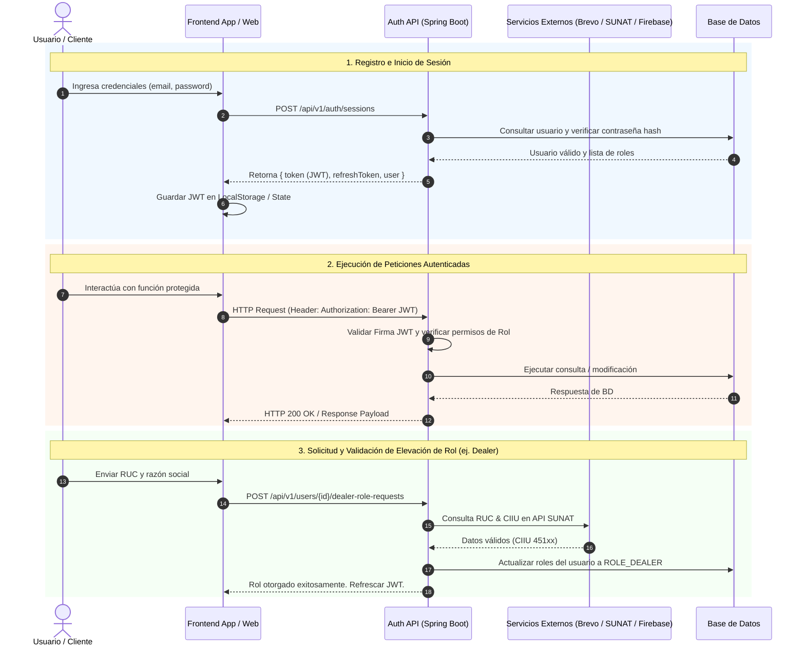

# Flujo de Autenticación y Autorización por Rol - SmartFinance Drive Platform

Este documento describe de manera detallada la arquitectura de autenticación (JWT & OAuth2), verificación de identidad (OTP Email/SMS), y los flujos específicos de registro, inicio de sesión y gestión de roles para los diferentes usuarios de la plataforma.

---

## 1. Arquitectura General de Autenticación

La seguridad de **SmartFinance Drive Platform** se basa en **JSON Web Tokens (JWT)** sin estado (Stateless), autenticación federada (Google OAuth2), y verificación multi-factor/OTP (Email vía Brevo API y SMS vía Firebase).

### Cabecera de Autorización
Todas las peticiones autenticadas deben incluir el token Bearer en el header HTTP:
```http
Authorization: Bearer <JWT_ACCESS_TOKEN>
```

---

## 2. Flujo Común de Autenticación (Público / Todos los Usuarios)

### 2.1. Registro Estándar
Crea una cuenta básica con rol por defecto `ROLE_USER`.
* **Endpoint:** `POST /api/v1/auth/registrations`
* **Payload:**
  ```json
  {
    "email": "usuario@ejemplo.com",
    "password": "Password123!",
    "firstName": "Juan",
    "lastName": "Pérez"
  }
  ```

### 2.2. Inicio de Sesión (Login)
Retorna el token JWT de acceso (`token`) y el token de refresco (`refreshToken`).
* **Endpoint:** `POST /api/v1/auth/sessions`
* **Payload:**
  ```json
  {
    "email": "usuario@ejemplo.com",
    "password": "Password123!"
  }
  ```
* **Respuesta:**
  ```json
  {
    "token": "eyJhbGciOi...",
    "refreshToken": "4a7b9c...",
    "user": {
      "id": 1,
      "email": "usuario@ejemplo.com",
      "roles": ["ROLE_USER"]
    }
  }
  ```

### 2.3. Autenticación con Google (OAuth2)
Autenticación o registro automático utilizando el ID Token provisto por Google Sign-In.
* **Endpoint:** `POST /api/v1/auth/google`
* **Payload:**
  ```json
  {
    "idToken": "eyJhbGciOi..."
  }
  ```

### 2.4. Refresco de Token
Renueva el `token` de acceso cuando ha expirado utilizando el `refreshToken`.
* **Endpoint:** `POST /api/v1/auth/tokens`
* **Payload:**
  ```json
  {
    "refreshToken": "4a7b9c..."
  }
  ```

### 2.5. Cierre de Sesión (Logout)
Invalida la sesión activa y el refresh token correspondiente.
* **Endpoint:** `DELETE /api/v1/auth/sessions/current`

### 2.6. Verificación de Correo por Código OTP (Brevo API)
* **Enviar Código:** `POST /api/v1/auth/email-verification/send` (`{"email": "user@example.com"}`)
* **Validar Código:** `POST /api/v1/auth/email-verification/verify` (`{"email": "user@example.com", "code": "123456"}`)

### 2.7. Verificación de Teléfono (Firebase SMS)
* **Validar Token SMS:** `POST /api/v1/auth/phone-verification/firebase` (`{"idToken": "firebase_token_string"}`)

---

## 3. Flujos de Autenticación y Elevación por Rol

### 3.1. Rol: `ROLE_USER` (Cliente / Comprador)
Es el rol asignado por defecto a cualquier usuario que se registra en la plataforma.

* **Flujo de Autenticación:**
  1. El cliente se registra vía `POST /api/v1/auth/registrations` o `POST /api/v1/auth/google`.
  2. Verifica opcionalmente su correo (`POST /api/v1/auth/email-verification/send`) y teléfono (`POST /api/v1/auth/phone-verification/firebase`).
  3. Inicia sesión en `POST /api/v1/auth/sessions` y almacena su JWT.
* **Acciones Autorizadas:**
  * Explorar catálogo público de vehículos y concesionarios.
  * Realizar simulaciones de crédito vehicular.
  * Enviar solicitudes de evaluación crediticia.
  * Agendar citas con concesionarios.

---

### 3.2. Rol: `ROLE_DEALER` (Concesionario de Vehículos)
Rol atribuido a empresas de venta y distribución de vehículos.

* **Flujo de Registro y Elevación de Rol:**
  1. El representante de la empresa se registra como usuario básico (`ROLE_USER`).
  2. **Solicitud de Rol Dealer:**
     * **Endpoint:** `POST /api/v1/users/{userId}/dealer-role-requests`
     * **Payload:** `{"ruc": "20123456789", "companyName": "Automotriz Lima SAC"}`
  3. **Verificación Automática RUC (SUNAT):**
     * El sistema valida la información ante SUNAT. Si la actividad económica principal (CIIU 451xx - Venta de vehículos automotores) coincide y el RUC figura como **ACTIVO** y **HABIDO**, el rol `ROLE_DEALER` es otorgado automáticamente.
  4. **Verificación Manual (Admin):**
     * En caso de requerir revisión manual, la solicitud pasa a estado pendiente para aprobación por un administrador vía `POST /api/v1/partners/corporate-verifications/{requestId}/approve`.
  5. **Acceso:** Al refrescar token o iniciar sesión nuevamente, la respuesta incluirá `ROLE_DEALER`.

---

### 3.3. Rol: `ROLE_FINANCIAL_INSTITUTION` (Entidad Financiera / Banco)
Rol destinado a bancos, cajas de ahorro y entidades financieras autorizadas para otorgar créditos.

* **Flujo de Registro y Elevación de Rol:**
  1. El representante de la institución se registra como `ROLE_USER`.
  2. **Solicitud de Rol Entidad Financiera:**
     * **Endpoint:** `POST /api/v1/users/{userId}/financial-institution-role-requests`
     * **Payload:** `{"ruc": "20987654321", "institutionName": "Banco CrediAuto SA"}`
  3. **Verificación Automática / Manual:**
     * El sistema consulta SUNAT (CIIU 64xx / 66xx - Intermediación financiera). Si la regla automática aplica, se autoriza inmediatamente. De lo contrario, un `ROLE_ADMIN` evalúa y aprueba mediante `POST /api/v1/partners/corporate-verifications/{requestId}/approve`.
  4. **Acceso:** Tras la aprobación, la sesión activa adquiere permisos de `ROLE_FINANCIAL_INSTITUTION`.

---

### 3.4. Rol: `ROLE_SALES_AGENT` (Agente de Ventas de Concesionario)
Usuarios gestores dependientes de un concesionario específico (`ROLE_DEALER`).

* **Flujo de Creación y Autenticación:**
  1. **Registro por parte del Concesionario:**
     * El concesionario autenticado (`ROLE_DEALER`) registra a un nuevo agente.
     * **Endpoint:** `POST /api/v1/dealers/me/sales-agents`
     * **Payload:** `{"email": "agente.ventas@dealer.com", "firstName": "Carlos", "lastName": "Gómez"}`
  2. **Activación:** El agente recibe un correo para configurar su contraseña inicial.
  3. **Inicio de Sesión:** El agente inicia sesión en `POST /api/v1/auth/sessions`. El JWT emitido contendrá `ROLE_SALES_AGENT` vinculado al ID de su concesionario empleador (`dealerId`).

---

### 3.5. Rol: `ROLE_ADMIN` (Administrador de la Plataforma)
Usuarios con privilegios totales de administración, auditoría y moderación.

* **Asignación y Acceso:**
  1. Cuentas creadas durante la inicialización de la base de datos (seeding) o elevadas por otro administrador.
  2. **Asignación explícita de roles:** `PUT /api/v1/users/{userId}/roles` con `["ROLE_ADMIN"]`.
  3. **Acciones Autorizadas:**
     * Aprobar o rechazar verificaciones corporativas de Dealers y Entidades Financieras.
     * Administrar usuarios, asignación de roles y configuraciones del sistema.

---

## 4. Diagrama de Secuencia General de Autenticación y Autorización



---

## 5. Resumen de Endpoints de Autenticación por Rol

| Flujo / Funcionalidad | Método | Endpoint | Permiso Requerido |
| :--- | :--- | :--- | :--- |
| **Registro General** | `POST` | `/api/v1/auth/registrations` | Público |
| **Iniciar Sesión (Login)** | `POST` | `/api/v1/auth/sessions` | Público |
| **Autenticación Google** | `POST` | `/api/v1/auth/google` | Público |
| **Refrescar Token** | `POST` | `/api/v1/auth/tokens` | Público |
| **Cerrar Sesión (Logout)** | `DELETE` | `/api/v1/auth/sessions/current` | Autenticado |
| **Enviar OTP Correo (Brevo)** | `POST` | `/api/v1/auth/email-verification/send` | Público |
| **Verificar OTP Correo** | `POST` | `/api/v1/auth/email-verification/verify` | Público |
| **Verificar SMS Firebase** | `POST` | `/api/v1/auth/phone-verification/firebase` | Público |
| **Solicitar Rol Dealer** | `POST` | `/api/v1/users/{userId}/dealer-role-requests` | `ROLE_USER` |
| **Solicitar Rol Ent. Financiera** | `POST` | `/api/v1/users/{userId}/financial-institution-role-requests` | `ROLE_USER` |
| **Registrar Agente de Ventas** | `POST` | `/api/v1/dealers/me/sales-agents` | `ROLE_DEALER` |
| **Aprobar Verificación Corporativa** | `POST` | `/api/v1/partners/corporate-verifications/{requestId}/approve` | `ROLE_ADMIN` |
| **Asignación Directa de Roles** | `PUT` | `/api/v1/users/{userId}/roles` | `ROLE_ADMIN` |

---
*Documento mantenido de acuerdo a la API de SmartFinance Drive Platform.*
