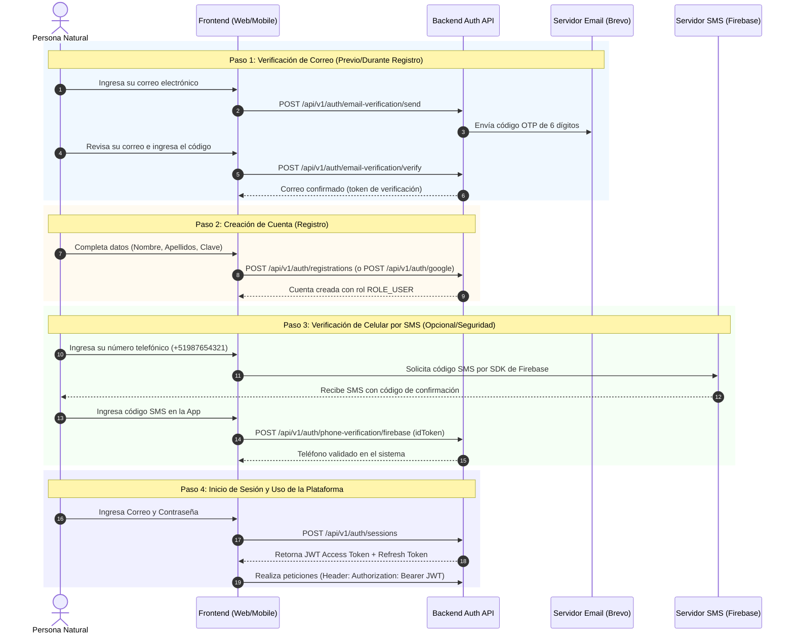
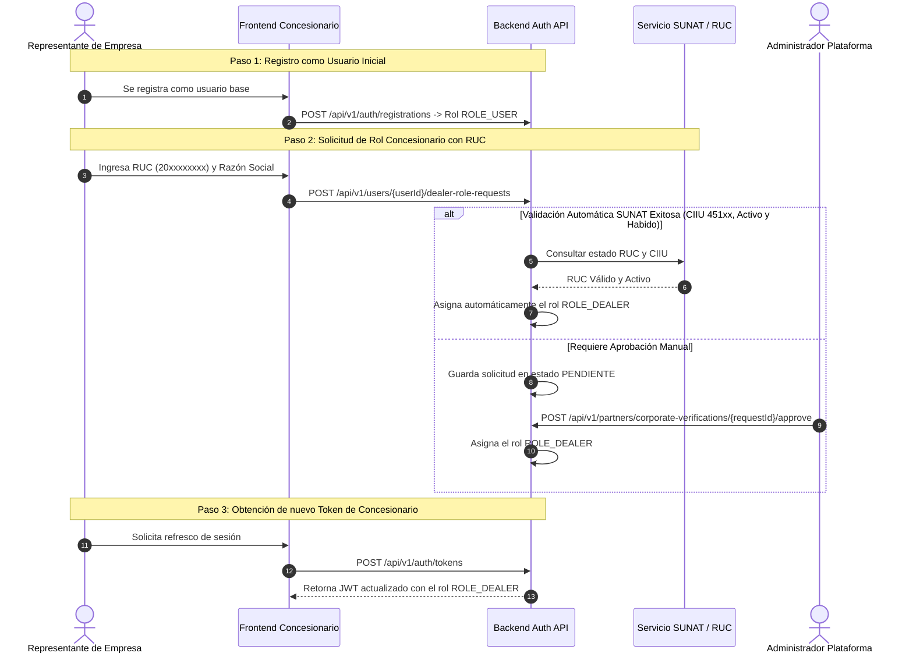
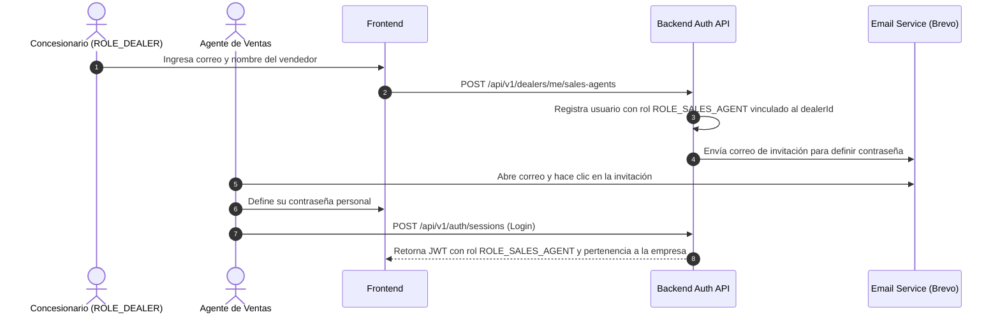

# Guias Paso a Paso del Flujo de Autenticación por Usuario - SmartFinance Drive Platform

Este documento describe **la experiencia real paso a paso** que sigue cada persona (usuario, concesionario, entidad financiera, agente de ventas o administrador) al registrarse, verificar su identidad, iniciar sesión y acceder a sus funciones dentro de la plataforma.

---

## 1. Flujo de Experiencia: Usuario / Comprador (`ROLE_USER`)

Este flujo describe el camino de una persona natural que desea explorar vehículos, simular créditos y solicitar evaluaciones.

### Pasos detallados del usuario:
1. **Paso 1 - Validar su correo:**
   * La persona presiona "Verificar Correo".
   * Recibe un email con un código OTP de 6 dígitos enviado mediante Brevo.
   * Lo ingresa en la pantalla y el sistema valida su autenticidad (`POST /api/v1/auth/email-verification/verify`).
2. **Paso 2 - Registrarse:**
   * Completa el formulario de registro (`POST /api/v1/auth/registrations`) o presiona "Continuar con Google" (`POST /api/v1/auth/google`).
   * El sistema le asigna el perfil de comprador `ROLE_USER`.
3. **Paso 3 - Validar su celular:**
   * Para solicitar cotizaciones o ser contactado, valida su teléfono.
   * Recibe un SMS enviado por Firebase, la app obtiene el token de validación y lo registra en el backend (`POST /api/v1/auth/phone-verification/firebase`).
4. **Paso 4 - Loguearse y Navegar:**
   * Inicia sesión con email y contraseña (`POST /api/v1/auth/sessions`).
   * Guarda su token JWT y navega por el catálogo de vehículos y simuladores.

---

## 2. Flujo de Experiencia: Concesionario (`ROLE_DEALER`)

Este flujo describe cómo una empresa de venta de vehículos registra su cuenta corporativa en la plataforma.

### Pasos detallados del concesionario:
1. **Paso 1 - Registro Base:** El representante crea primero una cuenta personal de usuario.
2. **Paso 2 - Solicitud de Empresa (RUC):** Dentro de la plataforma, va a "Convertirme en Concesionario" e ingresa el RUC 20 de su empresa.
3. **Paso 3 - Verificación en SUNAT:**
   * El sistema verifica automáticamente el RUC en SUNAT. Si la empresa pertenece al rubro automotriz (CIIU 451xx) y está **ACTIVA y HABIDA**, se le aprueba al instante.
   * De lo contrario, queda pendiente para revisión del equipo administrador.
4. **Paso 4 - Acceso al Panel de Dealer:** Al refrescar el token de sesión (`POST /api/v1/auth/tokens`), el usuario adquiere el rol `ROLE_DEALER`, desbloqueando la carga de vehículos y gestión de vendedores.

---

## 3. Flujo de Experiencia: Entidad Financiera / Banco (`ROLE_FINANCIAL_INSTITUTION`)

Este flujo describe la incorporación de un banco o caja de ahorro para otorgar créditos vehiculares.

### Pasos detallados del banco:
1. **Paso 1 - Registro Inicial:** El ejecutivo se registra con su correo corporativo (`POST /api/v1/auth/registrations`).
2. **Paso 2 - Solicitud de Rol Financiero:** Completa el formulario institucional ingresando el RUC de la entidad financiera (`POST /api/v1/users/{userId}/financial-institution-role-requests`).
3. **Paso 3 - Verificación de Autorización:**
   * Se valida la actividad económica (CIIU 64xx / 66xx) ante SUNAT.
   * El administrador de la plataforma valida la documentación legal y aprueba la solicitud mediante `POST /api/v1/partners/corporate-verifications/{requestId}/approve`.
4. **Paso 4 - Acceso al Portal Financiero:** El ejecutivo refresca su token de sesión y obtiene `ROLE_FINANCIAL_INSTITUTION`, lo que le permite evaluar solicitudes de crédito entrantes.

---

## 4. Flujo de Experiencia: Agente de Ventas (`ROLE_SALES_AGENT`)

Este flujo describe cómo un vendedor es incorporado a la plataforma por su Concesionario.

### Pasos detallados del agente de ventas:
1. **Paso 1 - Alta por el Concesionario:** El administrador del Concesionario ingresa los datos del vendedor en su panel (`POST /api/v1/dealers/me/sales-agents`).
2. **Paso 2 - Recepción de Invitación:** El vendedor recibe un correo de bienvenida enviado mediante Brevo.
3. **Paso 3 - Creación de Clave:** El vendedor hace clic en el enlace e ingresa su contraseña segura.
4. **Paso 4 - Inicio de Sesión:** Inicia sesión (`POST /api/v1/auth/sessions`) y accede a su panel con permisos de `ROLE_SALES_AGENT` para responder cotizaciones y atender a compradores.

---

## 5. Flujo de Experiencia: Administrador de Plataforma (`ROLE_ADMIN`)

Este flujo describe las acciones de control y supervisión del sistema.

### Pasos detallados del administrador:
1. **Paso 1 - Inicio de Sesión:** Inicia sesión en la plataforma con sus credenciales de administrador (`POST /api/v1/auth/sessions`).
2. **Paso 2 - Gestión de Solicitudes Corporativas:** Revisa la bandeja de verificaciones pendientes de Concesionarios y Bancos.
3. **Paso 3 - Aprobación / Rechazo:** Aprueba las empresas válidas ejecutando `POST /api/v1/partners/corporate-verifications/{requestId}/approve`.
4. **Paso 4 - Control Directo de Usuarios:** Puede asignar o modificar roles de cualquier usuario si es necesario usando `PUT /api/v1/users/{userId}/roles`.

---

## 6. Resumen General de Endpoints por Tipo de Usuario

| Rol / Tipo de Usuario | Paso del Flujo | Endpoint Utilizado | Método |
| :--- | :--- | :--- | :--- |
| **Cualquier Usuario** | Validar Email OTP | `/api/v1/auth/email-verification/send` y `/verify` | `POST` |
| **Cualquier Usuario** | Validar SMS Firebase | `/api/v1/auth/phone-verification/firebase` | `POST` |
| **Cualquier Usuario** | Crear Cuenta | `/api/v1/auth/registrations` / `/api/v1/auth/google` | `POST` |
| **Cualquier Usuario** | Iniciar Sesión | `/api/v1/auth/sessions` | `POST` |
| **Cualquier Usuario** | Refrescar Sesión | `/api/v1/auth/tokens` | `POST` |
| **ROLE_USER** | Solicitar Ser Concesionario | `/api/v1/users/{userId}/dealer-role-requests` | `POST` |
| **ROLE_USER** | Solicitar Ser Banco/Financiera | `/api/v1/users/{userId}/financial-institution-role-requests` | `POST` |
| **ROLE_DEALER** | Registrar Vendedor / Agente | `/api/v1/dealers/me/sales-agents` | `POST` |
| **ROLE_ADMIN** | Aprobar Empresa / Dealer | `/api/v1/partners/corporate-verifications/{requestId}/approve` | `POST` |
| **ROLE_ADMIN** | Cambiar Roles de Usuario | `/api/v1/users/{userId}/roles` | `PUT` |

---
*Documento estructurado bajo el modelo de experiencia de usuario (User Journey) para SmartFinance Drive Platform.*
