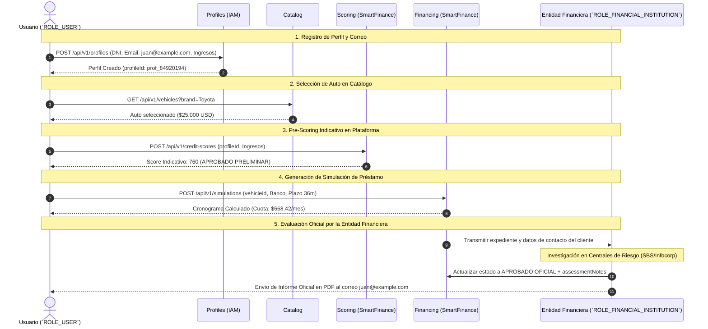

# Guía de Evaluación de Crédito Vehicular y Simulación Financiera

Este documento explica en detalle el flujo funcional y técnico que sigue un **Usuario Regular (`ROLE_USER`)** dentro de **SmartFinance Drive Platform** para explorar un vehículo, realizar una simulación de crédito y recibir la evaluación oficial emitida por una **Entidad Financiera (`ROLE_FINANCIAL_INSTITUTION`)**.

---

## 1. Modelo de Intermediación Digital

**SmartFinance Drive Platform** funciona como un **intermediario digital (Marketplace Financiero y Automotriz)** que conecta a tres actores clave:

1. **Cliente Final (`ROLE_USER`)**: Explora el catálogo, realiza pre-evaluaciones de riesgo e inicia simulaciones de crédito en un solo lugar.
2. **Plataforma (SmartFinance)**: Procesa las matemáticas financieras (método francés/alemán, tasas TEA/TNA, desgravamen), realiza un pre-scoring indicativo e intermedia el expediente entre el cliente y el banco.
3. **Entidad Financiera / Banco (`ROLE_FINANCIAL_INSTITUTION`)**: Entidad responsable de realizar la investigación crediticia oficial (en centrales de riesgo como SBS, Infocorp, etc.), emitir la aprobación/rechazo definitivo y enviar el informe de evaluación al cliente.

```mermaid
flowchart LR
    subgraph Cliente["1. CLIENTE FINAL (ROLE_USER)"]
        direction TB
        C1["Elige vehículo en el catálogo"]
        C2["Compara opciones bancarias"]
    end

    subgraph Plataforma["2. SMARTFINANCE (Intermediario)"]
        direction TB
        P1["Calcula cuotas y cronogramas"]
        P2["Realiza pre-scoring indicativo"]
        P3["Conecta cliente con el banco"]
    end

    subgraph Banco["3. ENTIDAD FINANCIERA (ROLE_FINANCIAL_INSTITUTION)"]
        direction TB
        B1["Recibe expediente desde la plataforma"]
        B2["Investiga en centrales de riesgo (SBS/Infocorp)"]
        B3["Aprueba crédito y emite informe al correo"]
    end

    Cliente -->|Inicia simulación| Plataforma
    Plataforma -->|Transmite expediente| Banco
```



---

## 2. Flujo Detallado Paso a Paso

### Paso 1: Creación del Perfil del Cliente e Ingreso de Datos de Contacto (`POST /api/v1/profiles`)

Antes de iniciar cualquier evaluación crediticia, el usuario registra sus datos personales y su **correo electrónico obligatorio (`email`)** y teléfono de contacto.

* **Endpoint**: `POST /api/v1/profiles`
* **Acceso**: `ROLE_USER`
* **Importancia del Correo**: El correo registrado (`email`) es el canal oficial mediante el cual la entidad financiera contactará al usuario y le enviará el informe formal del crédito.

```json
// Request Body
{
  "firstName": "Juan",
  "lastName": "Pérez",
  "documentType": "DNI",
  "documentNumber": "72849102",
  "email": "juan.perez@example.com",
  "phone": "+51987654321",
  "monthlyIncome": 4500.00
}
```

---

### Paso 2: Selección del Vehículo y Entidad Financiera

#### A. Exploración del Catálogo (`GET /api/v1/vehicles`)
El usuario busca el vehículo deseado en el catálogo. Puede filtrar por marca, precio máximo, año y condición (NUEVO / USADO). El sistema cuenta con **Búsqueda Fuzzy (Trigram + Levenshtein)** para corregir automáticamente errores de tipeo (ej. `"toyta"` -> `"Toyota"`).

* **Endpoint**: `GET /api/v1/vehicles?brand=Toyota&maxPrice=30000`
* **Resultado obtenido**: El `vehicleId` y el precio de lista (ej. `$25,000.00 USD`).

#### B. Consulta de Entidades Bancarias (`GET /api/v1/financial-entities`)
El cliente consulta las entidades financieras disponibles en la plataforma para comparar tasas de interés (TEA/TNA), seguros obligatorios y plazos disponibles.

* **Endpoint**: `GET /api/v1/financial-entities`
* **Resultado obtenido**: El `financialEntityId`, rango de cuota inicial mínima (ej. 10% a 20%) y tasas de interés ofertadas.

---

### Paso 3: Pre-Evaluación de Riesgo Crediticio (`POST /api/v1/credit-scores`)

El usuario genera una pre-evaluación en la plataforma para determinar su capacidad de endeudamiento inicial.

* **Endpoint**: `POST /api/v1/credit-scores`
* **Acceso**: `ROLE_USER` (asociado a su perfil).
* **Lógica del Motor de Scoring**:
  1. Analiza el ingreso mensual reportado frente a las deudas actuales (Ratio DTI).
  2. Emite un puntaje de riesgo crediticio indicativo (**Score entre 300 y 850**).
  3. Establece el estado preliminar (`APPROVED`, `REJECTED`, `REQUIRES_GUARANTOR`).

```json
// Request Body
{
  "profileId": "prof_84920194",
  "monthlyIncome": 4500.00,
  "currentDebts": 800.00,
  "employmentType": "DEPENDENT",
  "monthsEmployed": 24
}
```

```json
// Response Body (HTTP 201 Created)
{
  "scoreId": "sc_91029481",
  "profileId": "prof_84920194",
  "creditScore": 760,
  "riskCategory": "LOW",
  "status": "APPROVED",
  "maxBorrowingCapacity": 2200.00,
  "maxRecommendedLoan": 30000.00
}
```

---

### Paso 4: Generación de la Simulación de Crédito Vehicular (`POST /api/v1/simulations`)

El usuario genera la simulación exacta de su crédito vehicular especificando el vehículo, el banco, la cuota inicial y el plazo deseado.

* **Endpoint**: `POST /api/v1/simulations`
* **Acceso**: `ROLE_USER` (asociado a su `userId` autenticado mediante su Token JWT).
* **Cálculo del Cronograma de Pagos**:
  * Aplica el método de amortización seleccionado (Francés con cuota fija o Alemán con amortización constante).
  * Convierte la TNA/TEA pactada al periodo mensual.
  * Incorpora el seguro de desgravamen y seguro vehicular obligatorio.
  * Genera el desglose mes a mes (*Payment Schedule*).

```json
// Request Body
{
  "vehicleId": "veh_10293847",
  "financialEntityId": "fe_55019283",
  "vehiclePrice": 25000.00,
  "downPaymentAmount": 5000.00,
  "termMonths": 36,
  "interestRate": 12.5,
  "rateType": "TEA",
  "amortizationType": "FRENCH",
  "includeInsurance": true
}
```

```json
// Response Body (HTTP 201 Created)
{
  "id": "sim_77201938",
  "userId": "usr_105",
  "vehiclePrice": 25000.00,
  "downPaymentAmount": 5000.00,
  "loanAmount": 20000.00,
  "termMonths": 36,
  "effectiveAnnualRate": 12.5,
  "monthlyPayment": 668.42,
  "totalInterest": 4063.12,
  "totalAmountToPay": 24063.12,
  "paymentSchedule": [
    {
      "month": 1,
      "principalPayment": 459.12,
      "interestPayment": 209.30,
      "insuranceFee": 25.00,
      "totalMonthlyFee": 668.42,
      "remainingBalance": 19540.88
    }
  ]
}
```

---

### Paso 5: Evaluación Oficial y Emisión del Informe por la Entidad Financiera

Una vez creada la simulación, la solicitud queda disponible para la **Entidad Financiera (`ROLE_FINANCIAL_INSTITUTION`)** seleccionada.

1. **Investigación Externa por el Banco**: La entidad financiera realiza las consultas oficiales en centrales de riesgo (SBS, Infocorp) y valida la documentación del cliente.
2. **Canales de Recepción del Informe por el Cliente**:
   * **Canal 1: En Plataforma (Dashboard)**: El banco actualiza la simulación en la plataforma cambiando el estado a `APPROVED` / `REJECTED` e ingresando las observaciones oficiales en las notas de evaluación (`assessmentNotes`). El usuario ve el resultado en su panel de la plataforma.
   * **Canal 2: Envío por Correo Electrónico (`Profile.email`)**: Dado que el correo del usuario está registrado en su perfil (`juan.perez@example.com`), el banco le envía la carta de aprobación oficial o el informe detallado en PDF directamente a su casilla de correo electrónico.

---

### Paso 6: Proyección de Depreciación del Vehículo (`POST /api/v1/depreciation-projections`)

Como valor agregado, el cliente puede proyectar el valor comercial futuro de su auto durante el periodo del crédito para calcular su patrimonio neto y valor de reventa.

* **Endpoint**: `POST /api/v1/depreciation-projections`
* **Acceso**: `ROLE_USER`

```json
// Request Body
{
  "vehicleId": "veh_10293847",
  "initialPrice": 25000.00,
  "annualKmEstimate": 15000,
  "projectionYears": 3
}
```

```json
// Response Body (HTTP 201 Created)
{
  "projectionId": "proj_33019284",
  "vehicleId": "veh_10293847",
  "initialPrice": 25000.00,
  "projectedValues": [
    { "year": 1, "estimatedValue": 21250.00, "depreciationPercentage": 15.0 },
    { "year": 2, "estimatedValue": 18587.50, "depreciationPercentage": 25.65 },
    { "year": 3, "estimatedValue": 16400.00, "depreciationPercentage": 34.40 }
  ]
}
```

---

## 3. Diagrama de Secuencia del Flujo Completo


