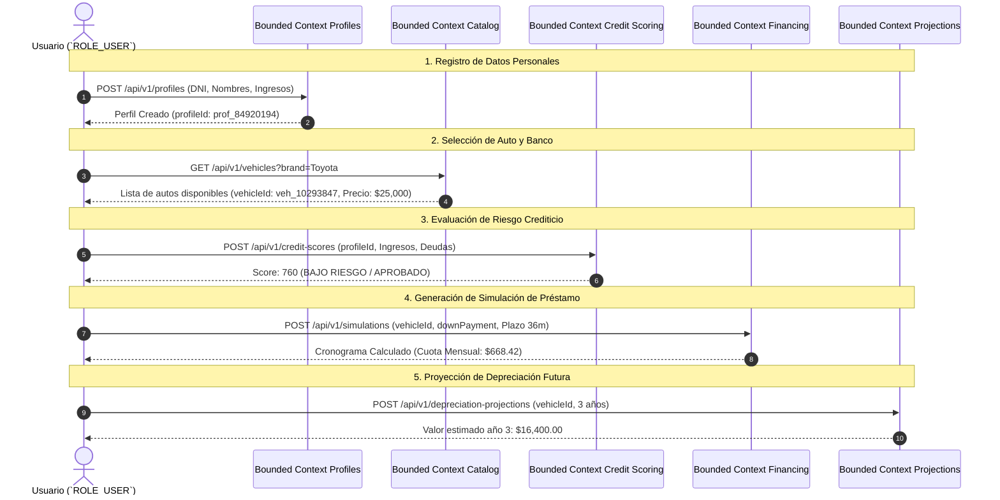

# Guía de Evaluación de Crédito Vehicular y Simulación Financiera

Este documento explica en detalle el flujo funcional y técnico que sigue un **Usuario Regular (`ROLE_USER`)** dentro de **SmartFinance Drive Platform** para explorar un vehículo, evaluar su riesgo crediticio y generar un plan de financiamiento vehicular personalizado.

---

## 1. Visión General del Proceso

El flujo de evaluación de crédito para un cliente final consta de **5 etapas consecutivas**:

```
+------------------+     +--------------------+     +------------------------+
|  1. Registro de  | --> | 2. Selección de    | --> | 3. Evaluación de Risk  |
|  Perfil Personal |     | Auto y Banco       |     | Credit Scoring         |
+------------------+     +--------------------+     +------------------------+
                                                                |
                                                                v
+------------------+     +--------------------+     +------------------------+
| 5. Proyección de | <-- | 4. Generación de   | <-- | Cronograma Aprobado    |
| Depreciación     |     | Simulación Crédito |     | y Seguro Calculado     |
+------------------+     +--------------------+     +------------------------+
```

---

## 2. Flujo Detallado Paso a Paso

### Paso 1: Creación del Perfil del Cliente (`POST /api/v1/profiles`)
Antes de iniciar cualquier evaluación crediticia, el usuario debe registrar su perfil con sus datos personales e identificación tributaria/civil.

* **Endpoint**: `POST /api/v1/profiles`
* **Acceso**: `ROLE_USER`
* **Datos requeridos**: Nombre, apellidos, DNI/RUC, correo electrónico, teléfono, dirección e ingresos mensuales reportados.

```json
// Request Body
{
  "firstName": "Juan",
  "lastName": "Pérez",
  "documentType": "DNI",
  "documentNumber": "72849102",
  "email": "juan.perez@example.com",
  "phone": "+51987654321",
  "monthlyIncome": 4500.00
}
```

---

### Paso 2: Selección del Vehículo y Entidad Financiera

#### A. Exploración del Catálogo (`GET /api/v1/vehicles`)
El usuario busca el vehículo deseado en el catálogo. Puede filtrar por marca, precio máximo, año y condición (NUEVO / USADO). El sistema cuenta con **Búsqueda Fuzzy (Trigram + Levenshtein)** para corregir automáticamente errores de tipeo.

* **Endpoint**: `GET /api/v1/vehicles?brand=Toyota&maxPrice=30000`
* **Resultado obtenido**: El `vehicleId` y el precio de lista (ej. `$25,000.00 USD`).

#### B. Consulta de Entidades Bancarias (`GET /api/v1/financial-entities`)
El cliente consulta las entidades financieras disponibles en la plataforma para comparar tasas de interés (TEA/TNA), seguros obligatorios y plazos disponibles.

* **Endpoint**: `GET /api/v1/financial-entities`
* **Resultado obtenido**: El `financialEntityId`, rango de cuota inicial mínima (ej. 10% a 20%) y tasas de interés ofertadas.

---

### Paso 3: Evaluación de Riesgo Crediticio (`POST /api/v1/credit-scores`)

El usuario solicita una evaluación de riesgo para determinar su capacidad de endeudamiento y la viabilidad del préstamo.

* **Endpoint**: `POST /api/v1/credit-scores`
* **Acceso**: `ROLE_USER` (asociado a su perfil).
* **Lógica del Motor de Scoring**:
  1. Analiza el ingreso mensual reportado frente a las deudas actuales.
  2. Evalúa el tipo de empleo (Independiente, Dependiente, Empresario) y antigüedad laboral.
  3. Emite un puntaje de riesgo crediticio (**Score entre 300 y 850**).
  4. Determina la **Categoría de Riesgo** (`LOW`, `MEDIUM`, `HIGH`) y el estado (`APPROVED`, `REJECTED`, `REQUIRES_GUARANTOR`).

```json
// Request Body
{
  "profileId": "prof_84920194",
  "monthlyIncome": 4500.00,
  "currentDebts": 800.00,
  "employmentType": "DEPENDENT",
  "monthsEmployed": 24
}
```

```json
// Response Body (HTTP 201 Created)
{
  "scoreId": "sc_91029481",
  "profileId": "prof_84920194",
  "creditScore": 760,
  "riskCategory": "LOW",
  "status": "APPROVED",
  "maxBorrowingCapacity": 2200.00,
  "maxRecommendedLoan": 30000.00
}
```

---

### Paso 4: Generación de la Simulación de Crédito Vehicular (`POST /api/v1/simulations`)

Una vez verificada su capacidad de pago, el usuario genera la simulación exacta de su crédito vehicular especificando el vehículo, el banco, la cuota inicial y el plazo deseado.

* **Endpoint**: `POST /api/v1/simulations`
* **Acceso**: `ROLE_USER` (asociado automáticamente a su `userId` autenticado mediante su Token JWT).
* **Cálculo del Cronograma de Pagos**:
  * Aplica el método de amortización seleccionado (Francés con cuota fija o Alemán con amortización constante).
  * Convierte la TNA/TEA pactada al periodo mensual.
  * Incorpora el seguro de desgravamen y seguro vehicular obligatorio.
  * Genera el desglose mes a mes (*Payment Schedule*).

```json
// Request Body
{
  "vehicleId": "veh_10293847",
  "financialEntityId": "fe_55019283",
  "vehiclePrice": 25000.00,
  "downPaymentAmount": 5000.00,
  "termMonths": 36,
  "interestRate": 12.5,
  "rateType": "TEA",
  "amortizationType": "FRENCH",
  "includeInsurance": true
}
```

```json
// Response Body (HTTP 201 Created)
{
  "id": "sim_77201938",
  "userId": "usr_105",
  "vehiclePrice": 25000.00,
  "downPaymentAmount": 5000.00,
  "loanAmount": 20000.00,
  "termMonths": 36,
  "effectiveAnnualRate": 12.5,
  "monthlyPayment": 668.42,
  "totalInterest": 4063.12,
  "totalAmountToPay": 24063.12,
  "paymentSchedule": [
    {
      "month": 1,
      "principalPayment": 459.12,
      "interestPayment": 209.30,
      "insuranceFee": 25.00,
      "totalMonthlyFee": 668.42,
      "remainingBalance": 19540.88
    }
  ]
}
```

---

### Paso 5: Proyección de Depreciación del Vehículo (`POST /api/v1/depreciation-projections`)

Como valor agregado, el cliente puede proyectar el valor comercial futuro de su auto durante el periodo del crédito para calcular su patrimonio neto y valor de reventa.

* **Endpoint**: `POST /api/v1/depreciation-projections`
* **Acceso**: `ROLE_USER`
* **Lógica**: Utiliza algoritmos de depreciación anual según la marca, modelo, tipo de combustible y kilometraje estimado anual.

```json
// Request Body
{
  "vehicleId": "veh_10293847",
  "initialPrice": 25000.00,
  "annualKmEstimate": 15000,
  "projectionYears": 3
}
```

```json
// Response Body (HTTP 201 Created)
{
  "projectionId": "proj_33019284",
  "vehicleId": "veh_10293847",
  "initialPrice": 25000.00,
  "projectedValues": [
    { "year": 1, "estimatedValue": 21250.00, "depreciationPercentage": 15.0 },
    { "year": 2, "estimatedValue": 18587.50, "depreciationPercentage": 25.65 },
    { "year": 3, "estimatedValue": 16400.00, "depreciationPercentage": 34.40 }
  ]
}
```

---

## 3. Diagrama de Secuencia del Flujo del Cliente


